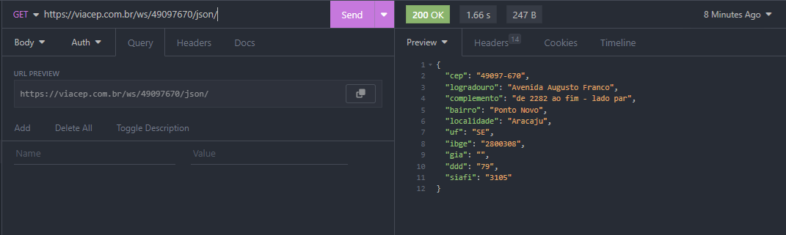
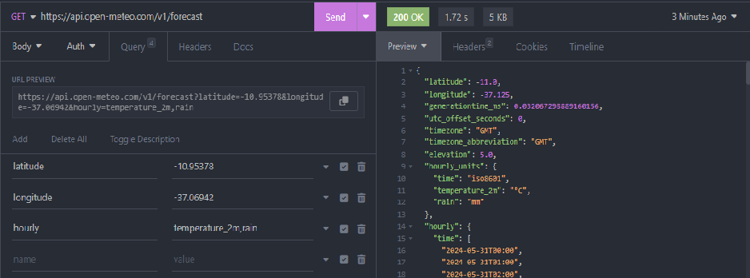

# Weather Forecast and Location
## Previsões do tempo e endereços em tempo real.
> Combinando recursos de geolocalização e previsão do tempo, o sistema é uma ferramenta essencial para melhorar a produtividade e a precisão no planejamento de atividades que dependem de condições geográficas e climáticas.

O foco na acessibilidade e simplicidade é fundamental para o sucesso de qualquer sistema interno. Por isso, será desenvolvida uma interface de usuário atraente e funcional, permitindo que os funcionários insiram facilmente as informações necessárias para obter dados de endereço e previsões meteorológicas.

Este projeto visa criar uma ferramenta útil para o dia a dia dos usuários que lidam com esse tipo de informação. As telas serão desenvolvidas com ênfase no design e na experiência do usuário, fornecendo dados importantes sobre endereços e previsões do tempo através de uma API.

## Ambiente de desenvolvimento
> HTML, CSS, JavaScript e Insomnia

#### Teste da requisição na API "viacep.com.br/" 

#### Teste da requisição na API "open-meteo.com/en/docs/"

Edmilson Correia Melo - [LinkedIn](https://www.linkedin.com/in/edmilsonmelo2606/) - ecmelo.26@gmail.com

Link do GitHub: [Github](https://github.com/Edmilson2606/weather_forecast_and_location) - https://github.com/Edmilson2606/weather_forecast_and_location

Link do sistema: [Weather Forecast and Location](https://wfl.netlify.app/) - https://wfl.netlify.app/